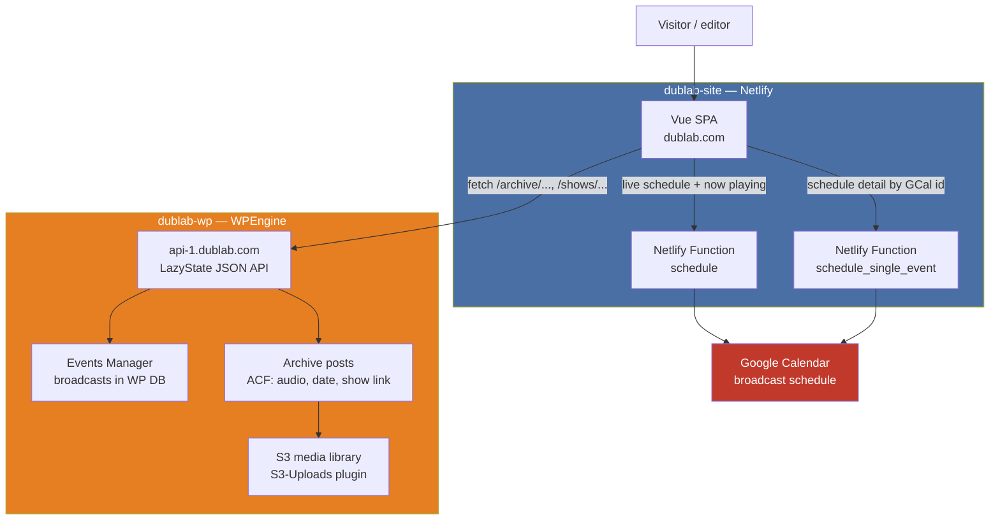
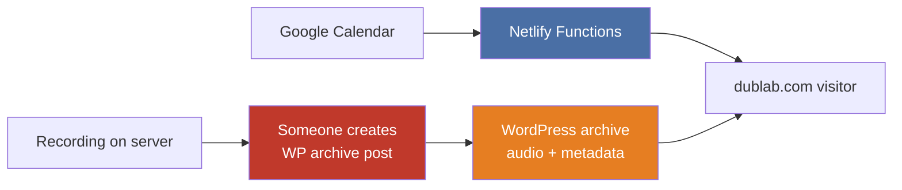
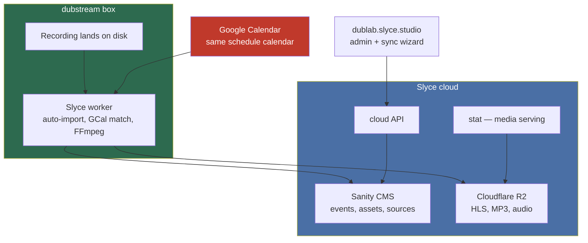
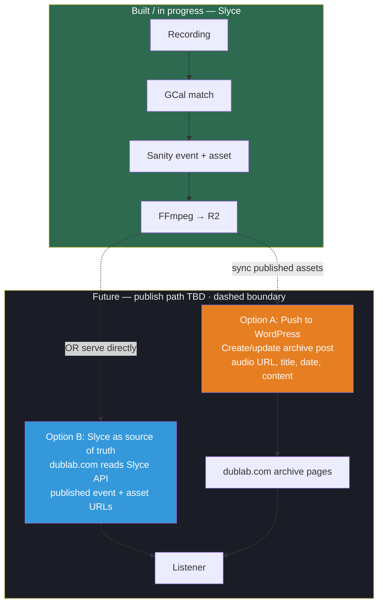

# dublab.com Today vs Slyce: Architecture Comparison

**Prepared for:** dublab  
**Repos:** [dublab-site](https://github.com/futurerootsinc/dublab-site) · [dublab-wp](https://github.com/futurerootsinc/dublab-wp)

This page describes how **dublab.com works today** (WordPress backend + Google Calendar via Netlify Functions) and how the **proposed Slyce workflow** would sit underneath — with two open options for what happens at publish time.

---

## Current: dublab.com stack

dublab.com is not a monolith. It is three layers that only partially talk to each other.

### Layer 1 — Frontend (`dublab-site`)

| Piece | Role |
|-------|------|
| **Vue SPA** | Public site at dublab.com. Built with Vue CLI, deployed to Netlify (`dist/`). |
| **LazyState client** | Most pages load JSON from WordPress by URL path — e.g. `GET api-1.dublab.com/archive/my-show` returns structured page data. |
| **Netlify redirects** | Short links, stream URLs, legacy paths; SPA fallback to `index.html`. |

The frontend does **not** embed WordPress templates. WordPress is a **headless JSON API** behind the SPA.

### Layer 2 — GCal via Netlify Functions

The **live broadcast schedule** on the site (schedule list, now playing, schedule detail pages under `/schedule/:id/...`) comes from **Google Calendar**, not from WordPress.

| Function | What it does |
|----------|----------------|
| `schedule` | Calls Google Calendar API for ~7 days of events (OAuth credentials + token in repo env). Parses titles, descriptions, Drive image links. In-memory cache ~1 hour. |
| `schedule_single_event` | Fetches one calendar event by GCal event id. |

The Vue audio store calls `/.netlify/functions/schedule` on load and keeps events in a client-side `Map` keyed by GCal id.

**Important:** This GCal path is **read-only** and **frontend-only**. It does not create WordPress archive posts or attach recordings.

### Layer 3 — WordPress backend (`dublab-wp`)

Hosted on **WPEngine** (`api-1.dublab.com`). The custom **dublab** theme exposes **LazyState** — route patterns map to PHP model files that return JSON.

| Route pattern | Model | Content |
|---------------|-------|---------|
| `/archive/...` | `broadcast` | Past show archive posts — title, content, **audio URL**, broadcast date, genres, show/DJ links |
| `/schedule/...` | `schedule` | Events Manager rows (legacy/alternate schedule surface) |
| `/events/...` | `event` | Public events (concerts, etc.) |
| `/shows/...` | `show` | Recurring show pages |

**Archive posts** (`/archive/...`) are the permanent record listeners browse. They are **WordPress posts** with Advanced Custom Fields — especially `audio`, `broadcast_date`, and links to show/DJ taxonomy. Media files live on **S3** via the S3-Uploads plugin.

**Events Manager** still powers some schedule/stream metadata inside WP (`eme_get_events`), but the main site schedule UI the public sees today is fed by **Netlify → GCal**.

### Current pain: two schedules, manual archive

- **Schedule** = GCal → Netlify → Vue (automated).
- **Archive** = recording → **manual** WordPress post (title, date, audio upload, publish).
- GCal event id is **not** wired through to archive deduplication on the WP side today.
- Credentials for GCal live in the Netlify function environment; WP and GCal are separate data stores.

---

## Proposed: Slyce backend workflow

Slyce replaces the **recording → metadata → processed audio** pipeline. Google Calendar becomes the **source of truth for matching** (same calendar dublab already uses), but matching and asset creation happen on the **dubstream box** and in **Sanity + R2**, not in Netlify Functions or manual WP entry.

### What Slyce automates (already built)

1. Recording detected on **dubstream**.
2. Worker fetches GCal events in a ±10 minute window around the recording start.
3. On match: creates **`slyce.event`** (deterministic id from GCal event id) and **`slyce.asset`** (parent, human-readable id).
4. FFmpeg renders HLS / MP3 / audio variants; uploads to **R2**; child asset docs in Sanity.
5. Re-running import is safe — same GCal id never duplicates.

See [dublab approach outline](dublab-approach-outline.html) and [GCal → WordPress workflow](gcal-to-wordpress-workflow.html) for step-by-step detail.

---

## Publish boundary: WordPress vs Slyce API

Everything above the dashed line is **in scope today or in active build**. Everything inside the dashed box is the **decision still to make** — how finalized, published show assets reach listeners on dublab.com.

### Option A — Push back to WordPress

Keep **dublab.com + LazyState + archive URLs** as the public site. Slyce becomes the **factory**; WordPress remains the **storefront**.

| Slyce produces | WordPress receives |
|----------------|-------------------|
| Show title, date, description (from GCal) | Post title, content, `broadcast_date` |
| MP3 / HLS URLs on R2 | ACF `audio` field or embed |
| Stable GCal event id | Meta field for dedup on re-sync |

**Pros:** Minimal change to public URLs, SEO, and existing archive UX.  
**Cons:** Two systems to maintain; need a reliable push job and field mapping.

### Option B — Replace WP archive source with Slyce API

**dublab.com** (or a future frontend) fetches **published** events/assets from Slyce (`cloud` + `stat`) instead of `api-1.dublab.com/archive/...`.

| Slyce surface | Replaces |
|---------------|----------|
| Sanity `slyce.event` + parent/child assets | WP archive post + ACF |
| `dublab.slyce.fm` / stat URLs | S3 audio URLs on archive posts |
| Studio sync + publish state | Manual WP admin |

**Pros:** Single source of truth; no duplicate posts; GCal dedup end-to-end.  
**Cons:** Frontend and URL migration work; WordPress may remain for events/shows pages until fully replaced.

### What likely stays either way

| System | Notes |
|--------|--------|
| **Netlify + Vue** | Can remain the public shell; schedule could eventually come from Slyce instead of Netlify Functions. |
| **GCal** | Still the schedule source; Slyce worker reads it directly (no Netlify middle layer). |
| **WP Events / shows / events pages** | Out of scope for first Slyce import; can migrate incrementally. |

---

## Side-by-side summary

| Concern | Today (WP + Netlify GCal) | Proposed (Slyce) |
|---------|---------------------------|----------------|
| Live schedule on site | GCal → Netlify Functions → Vue | GCal → worker (same calendar); site TBD |
| Archive / past shows | Manual WP posts + S3 audio | Auto event + asset from recording match |
| Dedup by calendar event | Not enforced on archive | Deterministic ids from GCal event id |
| Processed audio | Uploaded manually to S3 | FFmpeg → R2 automatically |
| Public API | `api-1.dublab.com` LazyState JSON | Slyce cloud + stat (Option B) or sync to WP (Option A) |
| Admin | WP admin + GCal editing | Slyce Studio + sync wizard |

---

## Recommended next steps

1. **Run Slyce import** on dubstream — populate Sanity from existing recordings + GCal (`/admin/box/dubstream/sync/`).
2. **Decide publish boundary** — Option A (WP push), Option B (Slyce API), or hybrid (new archives on Slyce, legacy stays on WP).
3. **Define archive format** — fields needed on dublab.com (audio player, show page link, Mixcloud, etc.) so push or API contract is clear.
4. **Plan Netlify function retirement** — once schedule reads from Slyce or WP is fed by Slyce, `schedule.js` can be deprecated.
