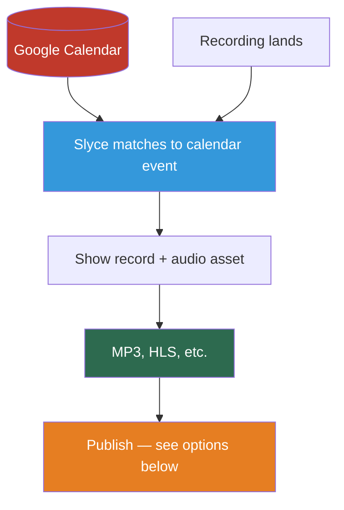
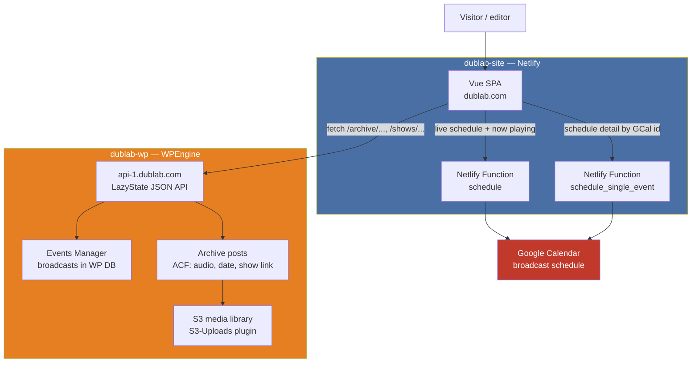
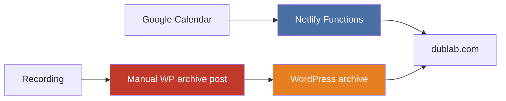
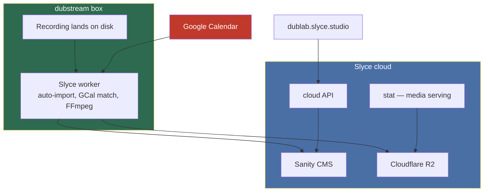
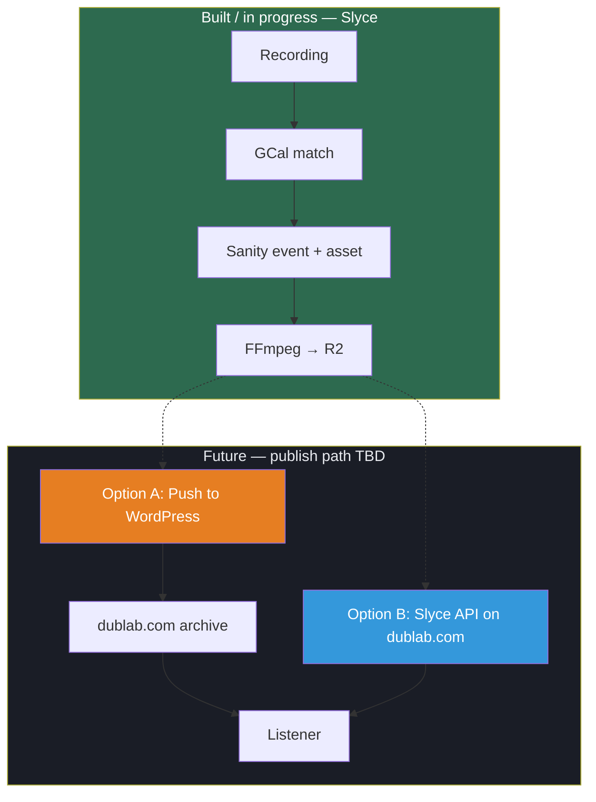

# dublab.com Today vs Slyce

**Prepared for:** dublab  
**Repos:** [dublab-site](https://github.com/futurerootsinc/dublab-site) · [dublab-wp](https://github.com/futurerootsinc/dublab-wp)

**Start here.** This page covers the **current dublab.com stack** (WordPress + Google Calendar via Netlify Functions) and the **proposed Slyce workflow**, including what happens at publish time. For service-level detail (Sanity ids, worker ops, import wizard), see the [platform approach](dublab-approach-outline.html).

---

## In plain language

**Today:** A show airs → the recording is saved → someone opens WordPress, types the title and date, uploads audio, and publishes. The calendar already knows the schedule (GCal powers the live schedule on the site), but **archive posts are still manual**.

**With Slyce:** The recording lands → Slyce checks the calendar for what was on air at that time → it creates a show record and audio asset → FFmpeg produces MP3 and streaming versions → the result is ready to publish. Same calendar event never creates duplicates.

| Today (manual) | With Slyce |
|----------------|------------|
| Someone notes when a show aired | Calendar already has the schedule |
| Manual WordPress archive post | Event + asset created automatically |
| Typed title, date, description | Pulled from the calendar event |
| Manual audio upload | FFmpeg → R2 automatically |
| Risk of duplicates or missed posts | One show record per GCal event id |

**Built and tested:** recording → match → create → audio processing. **Not yet configured:** pushing to dublab.com (WordPress or direct API — below).

---

## Current: dublab.com stack

dublab.com is three layers that only partially talk to each other.

### Layer 1 — Frontend (`dublab-site`)

| Piece | Role |
|-------|------|
| **Vue SPA** | Public site at dublab.com. Built with Vue CLI, deployed to Netlify (`dist/`). |
| **LazyState client** | Most pages load JSON from WordPress by URL path — e.g. `GET api-1.dublab.com/archive/my-show` returns structured page data. |
| **Netlify redirects** | Short links, stream URLs, legacy paths; SPA fallback to `index.html`. |

WordPress is a **headless JSON API** behind the SPA — not traditional WP templates.

### Layer 2 — GCal via Netlify Functions

The **live broadcast schedule** (schedule list, now playing, `/schedule/:id/...` detail) comes from **Google Calendar**, not WordPress.

| Function | What it does |
|----------|----------------|
| `schedule` | Google Calendar API for ~7 days of events. OAuth in Netlify env. In-memory cache ~1 hour. |
| `schedule_single_event` | One calendar event by GCal id. |

The Vue audio store calls `/.netlify/functions/schedule` on load. This path is **read-only** — it does not create archive posts or attach recordings.

### Layer 3 — WordPress backend (`dublab-wp`)

Hosted on **WPEngine** (`api-1.dublab.com`). The **dublab** theme exposes **LazyState** — URL patterns map to PHP models that return JSON.

| Route | Content |
|-------|---------|
| `/archive/...` | Past show archive posts — audio URL, broadcast date, genres, show/DJ links |
| `/schedule/...` | Events Manager rows (legacy schedule surface) |
| `/events/...` | Public events |
| `/shows/...` | Recurring show pages |

Archive posts use **ACF** (`audio`, `broadcast_date`, etc.). Media on **S3** via S3-Uploads.

### Current gap

- **Schedule** = GCal → Netlify → Vue (automated).
- **Archive** = recording → manual WordPress (not linked to GCal id for dedup).

---

## Proposed: Slyce backend

Slyce replaces **recording → metadata → processed audio**. Matching runs on **dubstream** (not Netlify); assets live in **Sanity + R2**.

Pipeline summary: auto-import → GCal match (±10 min) → `slyce.event` + `slyce.asset` → FFmpeg → R2. Details: [platform approach §4–6](dublab-approach-outline.html).

---

## Publish boundary: WordPress vs Slyce API

Built through FFmpeg → R2. **Still to decide:** how listeners get finalized shows on dublab.com.

| | Option A — Push to WP | Option B — Slyce as source |
|---|----------------------|---------------------------|
| **Idea** | Slyce is the factory; WordPress stays the storefront | dublab.com reads published assets from Slyce |
| **Pros** | Same archive URLs, SEO, existing UX | Single source of truth; end-to-end GCal dedup |
| **Cons** | Two systems; field mapping + sync job | Frontend migration; WP may remain for events/shows |

---

## Side-by-side

| Concern | Today | Proposed (Slyce) |
|---------|-------|------------------|
| Live schedule | GCal → Netlify → Vue | GCal → worker; site wiring TBD |
| Archive / past shows | Manual WP + S3 | Auto from recording match |
| Dedup by calendar event | Not on archive | Deterministic GCal event id |
| Processed audio | Manual S3 upload | FFmpeg → R2 |
| Public API | `api-1.dublab.com` | WP sync (A) or Slyce cloud/stat (B) |

---

## Next steps

1. **Run Slyce import** — `/admin/box/dubstream/sync/` ([details](dublab-approach-outline.html)).
2. **Decide publish boundary** — Option A, B, or hybrid.
3. **Define archive fields** — player, show links, Mixcloud, etc.
4. **Plan Netlify function retirement** — schedule can eventually come from Slyce.
