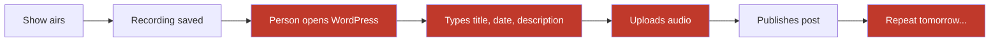
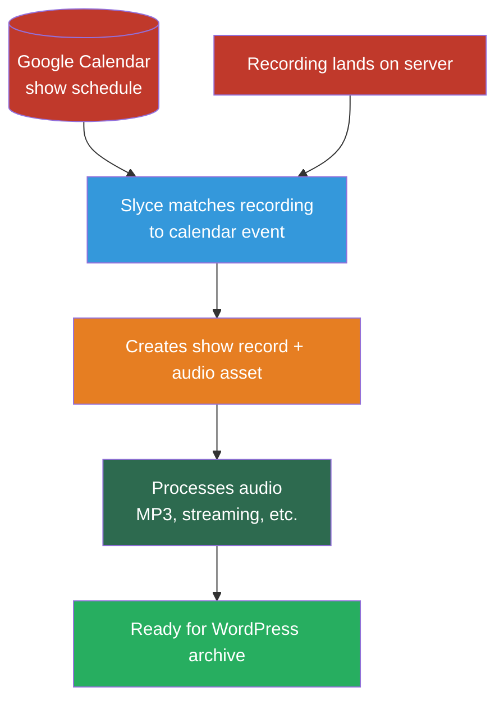
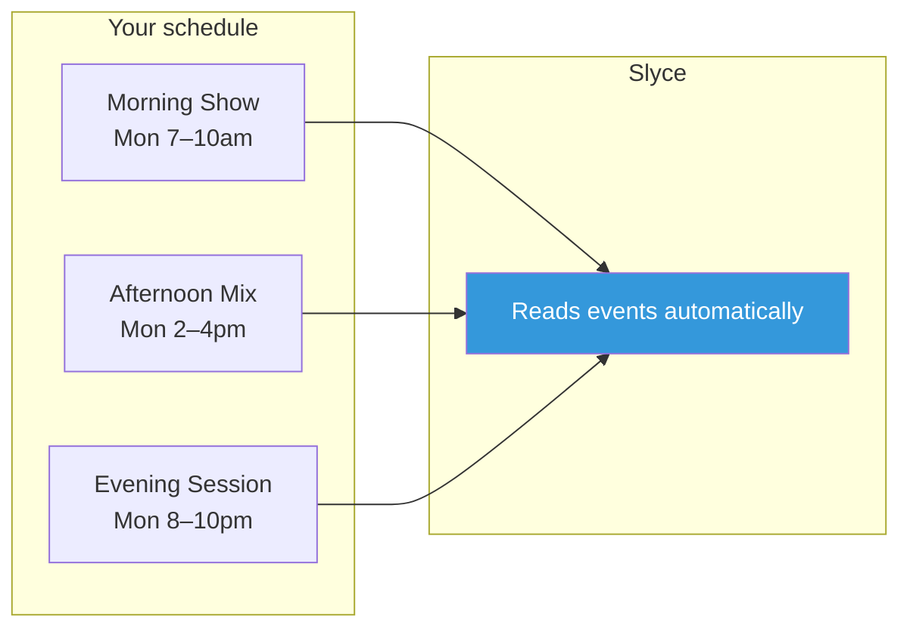
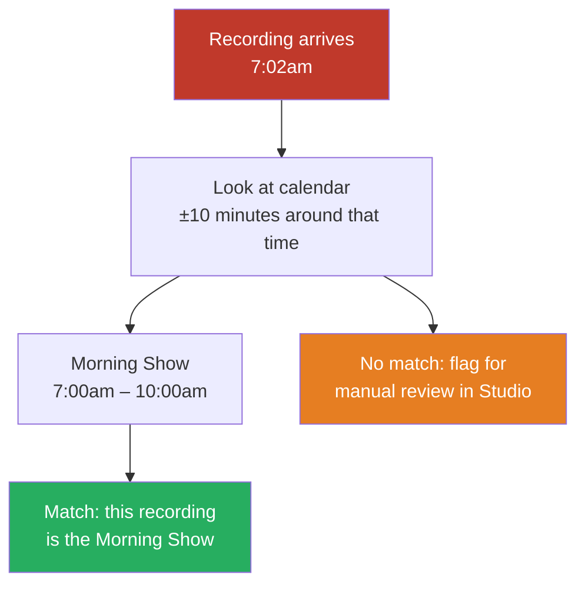
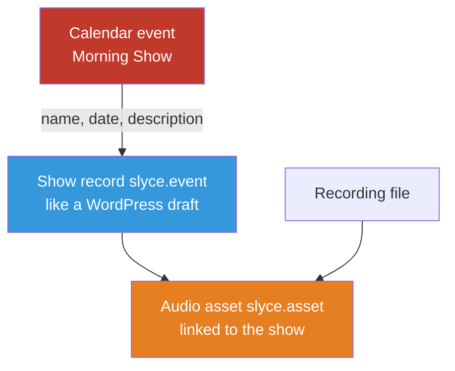
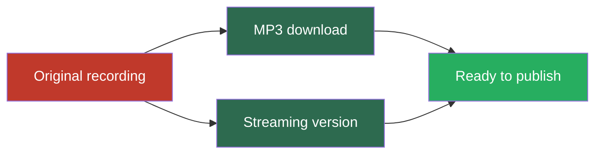
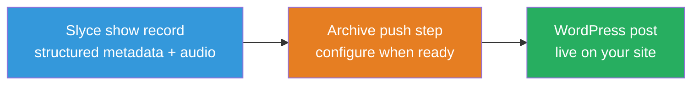
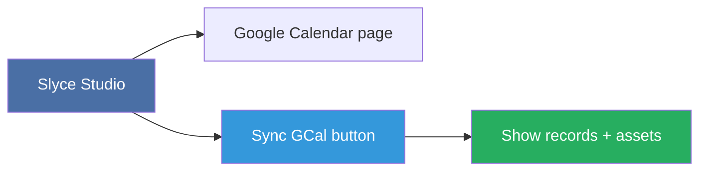
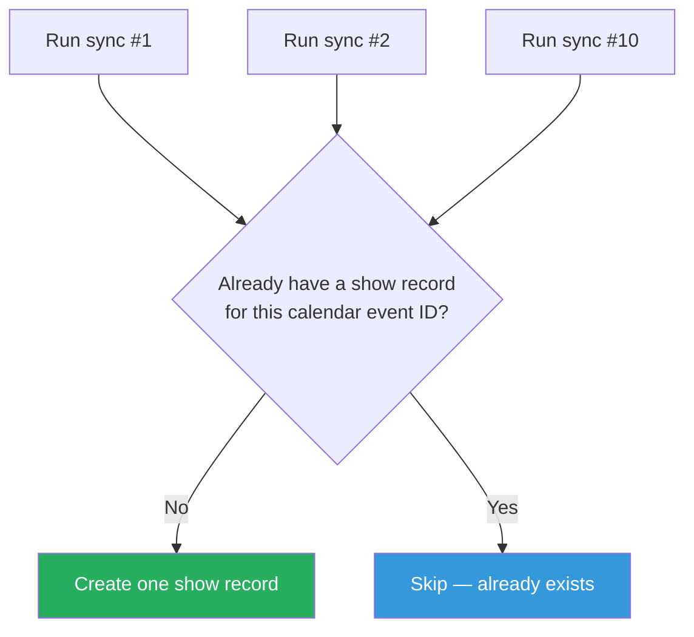
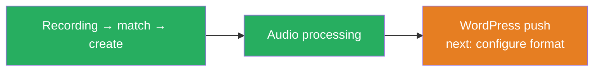

# GCal → WordPress Archive: What This Does

**For the non-technical reader.**

## The Old Way (Manual)

1. A radio show airs (e.g. "Morning Show" on Monday 7-10am)
2. The recording file lands on the Slyce server automatically
3. Someone has to manually go into WordPress, create a new post, type the show name, date, description, and publish it
4. They do this for every single show, every day

This is slow, error-prone, and nobody wants to do it.

## The New Way (Automated)

### Step 1: Google Calendar is the source of truth

Your broadcast schedule lives in Google Calendar. Each show is a calendar event with a name, time, and description. Slyce reads this calendar automatically.

### Step 2: Recording arrives → Slyce checks the calendar

When a recording file lands on disk, Slyce looks at what was on the calendar at that time. It finds the matching event — for example, if a recording arrived at 7:02am and "Morning Show" ran 7-10am, Slyce says "this recording is the Morning Show."

### Step 3: Slyce creates the show record and asset

At this point Slyce automatically creates two things:

- **A show record** (`slyce.event`) — thinks of it like a WordPress post draft. It has the show name, date, description pulled straight from the calendar event. It even saves the Google Calendar event ID so it never creates a duplicate if the same event runs again.
- **An audio asset** (`slyce.asset`) — thinks of it like the audio file that will be processed and published. It's linked to the show record.

### Step 4: Processing happens automatically

Slyce automatically starts processing the audio (converting formats, creating MP3 and streaming versions) and prepares it for publishing. No one needs to click anything.

### Step 5: Ready for WordPress

The show record has a `content` field designed to hold whatever format your WordPress archive needs (HTML, shortcodes, etc.). The data is structured and ready for a downstream step to push into WordPress.

## What This Replaces

| Old Way | New Way |
|---------|---------|
| Someone notes when a show aired | GCal already knows the schedule |
| Someone manually creates a WordPress post | Slyce creates the event + asset automatically |
| Someone types the show name, date, description | Pulled directly from the calendar event |
| Someone uploads the audio file | Slyce processes it automatically |
| Risk of forgetting or duplicating posts | Deterministic dedup — same GCal event never creates duplicates |

## What You See

In the Slyce admin, you can:

- Browse your calendar events on the **Google Calendar** page
- Click **Sync GCal** to scan existing recordings and match them against calendar events
- Find the auto-created show records and assets in the Studio

## Key Detail: No Duplicates

Because each Google Calendar event has a unique ID, Slyce can guarantee it never creates two show records for the same event. Even if you run the sync 10 times, same result — one show record per calendar entry.

## Current Status

The pipeline from "recording arrives" → "event + asset created" → "audio processing starts" is built and tested. The final step (pushing to WordPress with the right formatting) is ready for configuration once the archive format is decided.

