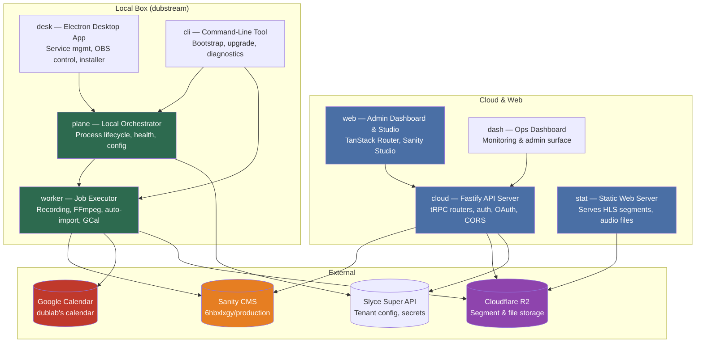
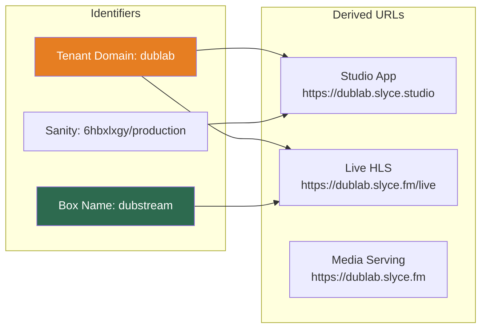
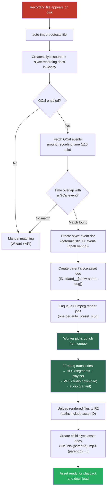
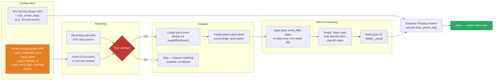

# Slyce for dublab — Platform Approach & Architecture Overview

**Prepared for:** dublab  
**Date:** May 2026  
**Status:** Post-data-model migration, ready for import

---

## 1. Executive Summary

dublab runs on Slyce — a purpose-built platform for radio station recording, asset management, and distribution. This document lays out the full architecture: how recordings on your box (`dubstream`) get from disk to listeners, how the Google Calendar pipeline automates metadata and publishing, and what's operational versus coming next.

The recent migration wiped dublab's Sanity project clean and rebuilt the data model. The old approach mixed render metadata into asset documents and used opaque IDs. The new model is cleaner: deterministic human-readable IDs, a proper parent/child asset hierarchy, and no dead fields. The import wizard is the next operational step — one click to bring sources, GCal events, and assets back into Sanity and enqueue FFmpeg renders.

---

## 2. Platform Architecture Overview

Slyce is not a single application. It's a set of nine interlocking services, each with a clear job. They communicate over tRPC (typed remote procedure calls), a message queue, and the filesystem.



**What each component does:**

| Service | Role | Where it runs |
|---------|------|--------------|
| **cloud** | Public API server — handles auth, Sanity CRUD, OAuth flows, R2 CORS configuration | Slyce-hosted |
| **web** | Browser dashboard — admin panels, recording browser, Sanity Studio integration, sync wizard | Browser → cloud |
| **stat** | Static file server — delivers HLS segments and audio files to listeners | Slyce-hosted |
| **dash** | Ops dashboard — monitoring and admin surface for internal operations | Browser → cloud |
| **plane** | Local orchestrator — manages worker lifecycle, health checks, process supervision | dublab's box (dubstream) |
| **worker** | Job executor — recording control, FFmpeg encoding, auto-import from disk, GCal matching, S3/R2 upload | dublab's box (dubstream) |
| **desk** | Electron desktop app — OBS integration, service management UI, installer wizard | Slyce operator machines |
| **cli** | Command-line tool — bootstrap new boxes, upgrade binaries, service start/stop/status | Any machine with access |

**Key architectural notes:**

- **tRPC everywhere** — typed end-to-end. The same TypeScript types that define the cloud API also define the worker's internal calls. No REST mismatch, no hand-written API docs.
- **The box is self-healing** — `plane` supervises `worker`. If the worker crashes, plane restarts it. If plane crashes, the OS launcher (launchd on macOS, NSSM on Windows) restarts plane.
- **Cloud outage ≠ stopped recording** — recording happens locally on the box. If the cloud API is unreachable, recordings continue; assets are created once connectivity resumes.
- **Sanity is the source of truth** for metadata (events, assets, sources, recordings). R2 holds the media files. The two are linked by document IDs baked into upload paths.

---

## 3. dublab-Specific Setup

dublab is a tenant on the Slyce platform. That means your configuration follows a consistent pattern shared by all Slyce instances.



**Domains:**
- **Studio app:** `https://dublab.slyce.studio` — the admin dashboard, recording browser, sync wizard
- **Live HLS:** `https://dublab.slyce.fm/live` — live stream endpoint (box ID derived from tenant subdomain)
- **Media serving:** `https://dublab.slyce.fm` — on-demand file access (past broadcasts, pre-recorded content)

**Sanity:**
- Project: `6hbxlxgy` (dataset: `production`)
- Token-based auth (stored in `SANITY_TOKEN` env var and tenant secrets)
- After the recent migration: **clean slate** — zero documents except a default FFmpeg preset synced from Super API

**Box (dubstream):**
- Runs `plane` + `worker` locally
- Configured via Slyce Super API — secrets (API keys, GCal OAuth tokens, preset configs) are stored per-tenant and synced to the box
- Recording root: local disk directory monitored for new files

**CORS:**
- `https://dublab.slyce.studio` is the allowed origin on the R2 bucket — no other domain can fetch media directly

---

## 4. The Recording Pipeline

This is the core flow. A recording appears on disk, and by the end of the pipeline it's an asset in Sanity with rendered HLS, MP3, and audio variants pushed to R2.



**Step by step:**

1. **Detection** — The worker watches the recording directory. When a new recording file lands, it creates a `slyce.source` document (the raw origin) and a `slyce.recording` document (the specific recording instance) in Sanity.

2. **GCal matching** — If the box has GCal integration configured, the worker fetches events from dublab's calendar in a time window around the recording timestamp. It looks for an event whose start time falls within ±10 minutes of the recording start.

3. **Event & asset creation** — On a match, it creates two Sanity documents:
   - **`slyce.event`** — the GCal event metadata (title, description, time range, GCal event ID). Uses a deterministic ID (`event-{gcalEventId}`) so re-running the import is safe (deduplication via `createIfNotExists`).
   - **`slyce.asset`** — the parent asset linking the source recording to the GCal event. Its ID is human-readable: `{date}__{show-name-slug}` (e.g. `2025-12-05__dublab-presentation`).

4. **Render enqueue** — For each configured preset slug (`auto_preset_slugs` box secret), the worker enqueues an FFmpeg render job. Deduplication keys prevent double-enqueuing the same render.

5. **Transcode & publish** — The worker picks up each job, runs FFmpeg with the preset parameters, uploads the output files to R2, and creates child asset documents in Sanity with deterministic IDs (`hls-{parentId}`, `mp3-{parentId}`, etc.).

---

## 5. Asset Lifecycle & Publishing

Assets follow a clear parent-child hierarchy. The parent holds the editorial metadata (show name, date, GCal link, description). Children are the technical render outputs.

```mermaid
graph TB
    subgraph "Raw Origin"
        SOURCE["slyce.source<br/>The recording origin file"]
        RECORDING["slyce.recording<br/>A specific recording instance"]
    end

    subgraph "Editorial Layer"
        EVENT["slyce.event<br/>GCal metadata<br/>ID: event-{gcalEventId}<br/>Fields: name, start, end,<br/>description, gcalEventId"]
        PARENT["slyce.asset (parent)<br/>ID: 2025-12-05__show-name<br/>Fields: source._ref, event._ref,<br/>name, sourceOrigin:"gcal-import"""]
    end

    subgraph "Render Layer (Child Assets)"
        HLS["slyce.asset (child)<br/>ID: hls-2025-12-05__show-name<br/>preset: hls"]
        MP3["slyce.asset (child)<br/>ID: mp3-2025-12-05__show-name<br/>preset: mp3"]
        AUDIO["slyce.asset (child)<br/>ID: audio-2025-12-05__show-name<br/>preset: audio"]
    end

    subgraph "Storage"
        R2_HLS["R2: /hls/..."]
        R2_MP3["R2: /mp3/..."]
    end

    SOURCE --> RECORDING
    RECORDING --> PARENT
    EVENT --> PARENT
    PARENT --> HLS
    PARENT --> MP3
    PARENT --> AUDIO
    HLS --> R2_HLS
    MP3 --> R2_MP3
    AUDIO --> R2_MP3

    style PARENT fill:#e67e22,color:#fff
    style EVENT fill:#3498db,color:#fff
    style HLS fill:#2d6a4f,color:#fff
    style MP3 fill:#2d6a4f,color:#fff
    style AUDIO fill:#2d6a4f,color:#fff
```

**ID conventions (all human-readable, all deterministic):**

| Doc Type | ID Format | Example |
|----------|-----------|---------|
| Event | `event-{gcalEventId}` | `event-d1e2f3g4h5i6` |
| Parent asset | `{date}__{show-name-slug}` | `2025-12-05__dublab-presentation` |
| Child asset | `{presetKey}-{parentId}` | `hls-2025-12-05__dublab-presentation` |

**Why deterministic IDs matter:**
- You can re-run the import wizard without creating duplicates
- Asset URLs are predictable and debuggable
- R2 upload paths embed the asset ID, so the relationship between a file on disk and a Sanity document is always traceable

**What a published asset looks like to a listener:**
- HLS stream: a `.m3u8` playlist pointing to `.ts` segments — served by `stat` from R2
- MP3 download: a single audio file — served by `stat` from R2
- The parent asset document in Sanity holds the editorial context (show name, date, description, GCal link)

---

## 6. GCal Automation

The Google Calendar integration is the backbone of dublab's automated publishing. It's what eliminates the "find the recording, manually type the show name" step.

### How it works



### Configuration points

| Setting | Where | What it controls |
|---------|-------|-----------------|
| `gcal_credentials_json` | Tenant secrets (Super API) | OAuth client credentials for Google Calendar API |
| `gcal_token` | Tenant secrets (Super API) | OAuth access token (set up via Settings → OAuth in the UI) |
| `gcal_calendar_id` | Tenant secrets (Super API) | Which Google Calendar to read (defaults to "primary") |
| `gcal_event_filter` | Tenant secrets (Super API) | Optional regex to strip noise from event summaries (e.g. remove "LIVE:" prefixes) |
| `auto_preset_slugs` | Box secrets (Super API) | Which FFmpeg presets to render (e.g. "hls,mp3,audio") |

### Idempotency guarantees

- **Events:** Use `createIfNotExists` with deterministic IDs — running the same import twice produces one document, not two
- **Sources:** Duplicate source docs (same recording `_ref` → program source) are collapsed by `pickAutoAssetSources()`
- **Render jobs:** Use `dedupeKey: ["ffmpeg-asset-render", assetId, renderKey]` — the queue will not enqueue the same render twice

### Edge cases handled

- **No calendar configured:** Pipeline skips GCal matching; assets can be matched manually via the Wizard
- **Event not found:** Same as above — the source is in Sanity, ready for manual attribution
- **Multiple sources per recording group:** The system prefers "program" sources over other types; standalone sources (no recording ref) are processed individually
- **Invalid regex in event filter:** Logged as a warning; the pipeline continues without filtering
- **OAuth token expired:** Worker logs a descriptive error pointing to Settings → OAuth for re-authorization

### Manual matching (Wizard)

When GCal matching doesn't find an event, or when you want to override an automatic match:
1. Navigate to **Studio → Boxes → dubstream → Sync** at `/admin/box/dubstream/sync/`
2. View the unmatched sources with their timestamps
3. Select the correct GCal event from the calendar view
4. Confirm — creates the event and asset docs, enqueues renders

---

## 7. Ops & Deploy

### Box management

dublab's box (`dubstream`) runs two core services locally:

- **`plane`** — the orchestrator. Manages worker lifecycle, handles health checks, exposes a local tRPC API for the desktop app and CLI. Listens on `127.0.0.1:2025` (Lease API).
- **`worker`** — the job executor. Runs FFmpeg transcodes, auto-import, GCal integration, S3/R2 uploads, and drive/YouTube push.

Services are supervised:
- **macOS:** launchd agents (auto-start on boot)
- **Windows:** NSSM (Non-Sucking Service Manager)
- **On failure:** plane restarts worker; OS launcher restarts plane

### Binary management

FFmpeg, Node, OpenSSL, and other runtime dependencies are bundled and managed through the Slyce upgrade pipeline:
- `slyce upgrade` — downloads the latest worker binary and stages it
- `slyce service restart` — swaps binaries and restarts services
- Auto-updater service (optional) — scheduled checks for new versions

### Logging & monitoring

- **Structured JSON logging** via `logtape` — every job, every match, every error is a structured log line
- **Two sinks:** file (local disk, rotated) and Loki (aggregated, searchable)
- **Worker logs:** `/Users/seb/Library/Application Support/Slyce/logs/binaries/worker/{stdout,stderr}.log`
- **Plane logs:** same pattern under `logs/binaries/plane/`
- **Log viewer:** available in the desktop app under worker/plane log tabs

### Media storage

- **Primary storage:** Cloudflare R2 (S3-compatible, no egress fees)
- **Serving layer:** `stat` (a static web server) serves files from R2 directly
- **CORS:** Bucket policy allows `https://dublab.slyce.studio` — no other origin can fetch media
- **Upload path convention:** Files are organized by asset ID — the Sanity document ID maps directly to the R2 path

### Upgrades

- **CLI stages** new binaries before swapping — no partial upgrade state
- **Restart swaps** the runtime target and restarts services in-place
- **Auto-updater** (installable via `slyce updater-install`) handles unattended upgrades
- **Rollback** — previous binary is preserved until the next upgrade

---

## 8. Current State & Next Steps

### Where we are now

The Sanity project (`6hbxlxgy/production`) is a **clean slate**:

| Resource | Count | Notes |
|----------|-------|-------|
| Sources (`slyce.source`) | 0 | Will populate on import |
| Recordings (`slyce.recording`) | 0 | Same |
| Events (`slyce.event`) | 0 | Will populate on GCal match |
| Assets (`slyce.asset`) | 0 | Same |
| Publish docs | 0 | Not yet in scope |
| FFmpeg presets | 1 | Default preset synced from Super API |

The data model has been cleaned up:
- **Removed** dead `renders` field writes from the old approach
- **Fixed** child asset ID format — `hls-{parentId}` instead of the old opaque prefix
- **Fixed** parent asset ID format — `2025-12-05__show-name-slug` instead of opaque concatenations
- **Fixed** type alignment across all frontend components (player, render cards, forms)
- **Regenerated** GROQ TypeScript types against the clean schema

### Immediate next step: Run the import

Navigate to **Studio → Admin → Box → dubstream → Sync** (`/admin/box/dubstream/sync/`):

1. **Dry Run ON** (recommended first pass) — see what would be matched without writing anything
2. Review the match list — confirm source-to-GCal-event alignments
3. **Dry Run OFF** — click Import
4. Worker picks up the queue — monitor via the job status dashboard

### After the import

- FFmpeg will transcode each matched recording into the configured presets (HLS, MP3, audio)
- Rendered files land in R2
- Child asset documents appear in Sanity
- Assets become available for playback and download through the studio

### If something needs re-running

The wipe script at `apps/worker/src/lib/wipe-sanity-project.ts` can clear all regeneratable documents while preserving FFmpeg presets. Re-running the import after a wipe is safe — deterministic IDs mean no duplicates.

---

## 9. Call-to-Action / Discussion Points

### Ready now

1. **Import run** — ~30 minutes to walk through the Sync Wizard and kick off the import. This is the single action that brings dublab from clean slate to populated.
2. **Worker monitoring** — watch the job queue after import to confirm renders complete.
3. **Verify playback** — check that child assets resolve correctly and HLS/MP3 URLs work from the studio.

### Worth discussing

4. **Preset configuration** — The current setup uses one default FFmpeg preset. Do you want additional presets (different bitrates, format variants, artwork embedding)? Configured via `auto_preset_slugs` box secret.
5. **GCal event filter regex** — If your calendar event summaries have recurring prefixes (e.g. "LIVE: Show Name"), we can set up a regex to strip them for cleaner asset names.
6. **Calendar scope** — Which Google Calendar should the worker read? Currently defaults to the primary calendar. If dublab uses multiple calendars for different show types, we can configure per-box calendar selection.
7. **Push destinations** — The pipeline currently lands assets in Sanity + R2. Slyce also supports Google Drive and YouTube push for distribution. Worth enabling? Related: publishing workflows (scheduled publish, draft/review).
8. **Retention policy** — Recordings on disk accumulate. Do you want automatic cleanup after successful render + publish? Configurable per-box.
9. **Monitoring & alerting** — Currently logs are structured and searchable. If you want proactive alerts (render failures, disk pressure, GCal auth expiry), we can configure Loki-based alerting.

### Quick reference

| Action | Where |
|--------|-------|
| Run the import | `/admin/box/dubstream/sync/` |
| View recordings | Studio → Sources → Browser |
| Check worker status | Dashboard → Worker → Status |
| View logs | Dashboard → Worker/Plane → Logs |
| Reconnect GCal | Settings → OAuth |
| Configure presets | Box settings → `auto_preset_slugs` |
| Force re-import | Wipe script → re-run import |
